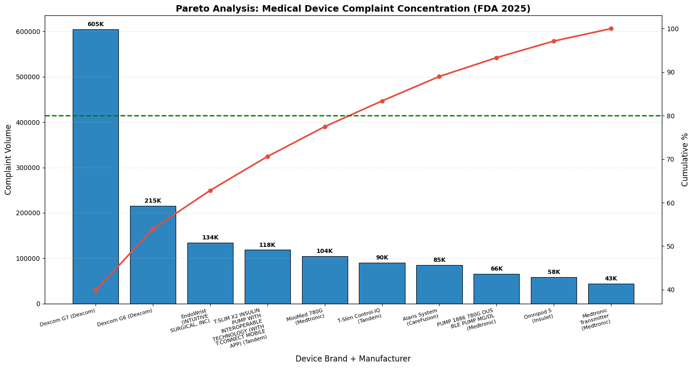

# FDA MAUDE Quality Analytics: Complaint Trend & Risk Analysis

Built an end-to-end analytics workflow on FDA MAUDE (Manufacturer and User Facility Device Experience) data to analyze post-market medical device complaints and identify recurring failure patterns, complaint concentration risks, traceability gaps, and potential CAPA opportunities.

This project mirrors how a Quality Engineer or Continuous Improvement professional would investigate complaint data in an ISO 13485/FDA-regulated environment.

---

## Business Problem

Medical device complaint data is highly fragmented across multiple FDA MAUDE files:

- MDR Event reports  
- Device records  
- Patient records  
- Narrative complaint text  

The challenge:

- Millions of records across separate datasets  
- Missing links between complaint and device records  
- Unstructured complaint narratives  
- Difficult to quickly identify recurring failures  

I wanted to convert raw complaint data into actionable quality insights.

---

## Dataset Overview

### MDR Event Table  
Core complaint event dataset

**Records analyzed:** **13.8M+**

Key fields:
- MDR_REPORT_KEY  
- DATE_RECEIVED  
- EVENT_TYPE  
- REPORT_SOURCE  
- REPORTER_COUNTRY_CODE  

### Device Table  
Contains manufacturer + product level data

**Records analyzed:** **2.19M+**

Key fields:
- Manufacturer  
- Brand  
- Product Code  

### Patient Table  
Used for severity analysis

Key fields:
- Injury  
- Death  
- Malfunction severity score  

### Narrative Table  
Used for failure text mining

---

## Tools Used

Handling millions of rows in pandas alone was slow, so I used:

- **DuckDB** → fast SQL joins on large flat files  
- **Python** → data cleaning + analysis  
- **Pandas** → transformations  
- **Matplotlib** → visualization  
- **Scikit-learn (CountVectorizer)** → NLP keyword extraction  

---

## Key Insights

### Complaint Volume Trend
Monthly complaint volume remained consistently high in 2025:

**347K → 441K complaints/month**

This indicates recurring complaint inflow rather than isolated spikes.

---

### Manufacturer Concentration Risk

Top manufacturers:

- Dexcom → **834K**
- Medtronic Puerto Rico → **410K**
- Tandem Diabetes Care → **298K**

Complaint concentration was heavily skewed toward diabetes device manufacturers.

---

### Pareto Risk Analysis

A small number of products drove most complaints:

- **Dexcom G7 → 605K complaints**
- Top products crossed the **80% cumulative threshold**

This helps prioritize CAPA efforts on the highest-risk product lines.

---

### Severity Analysis

Used patient severity scores from FDA reports:

- **0** → No serious patient harm  
- **1–2** → Moderate impact  
- **3** → Significant injury risk  
- **4–5** → Critical severity/death-related events  

Findings:

- Severity 0 → **2.67M**
- Severity 3 → **620K**
- Severity 4–5 → lower frequency but highest risk

---

### Geographic Complaint Trends

Top reporting country:

**United States → 2.7M+ complaints**

Followed by:

- Switzerland  
- Japan  
- Germany  
- Canada  

---

## NLP Failure Pattern Mining

Complaint narratives were unstructured text, so I used **CountVectorizer** to tokenize complaint descriptions, remove irrelevant words, and identify recurring failure terms.

Most common issues found:

- Injury  
- Failure  
- Malfunction  
- Battery  
- Infection  
- Leak  
- Fracture  
- Overheat  

---

## Traceability Gap

When joining complaint records with device data:

- **2.72M** complaint reports in 2025  
- **541K** had no matching device record  
- **19.8% traceability gap**

This means nearly 1 in 5 complaints lacked linked device information, which could slow investigations, CAPA actions, and audit readiness.

---

## Why This Project Matters

This project helped me combine:

- Quality engineering  
- Root cause analysis  
- Risk prioritization  
- Complaint analytics  
- Regulatory awareness  

